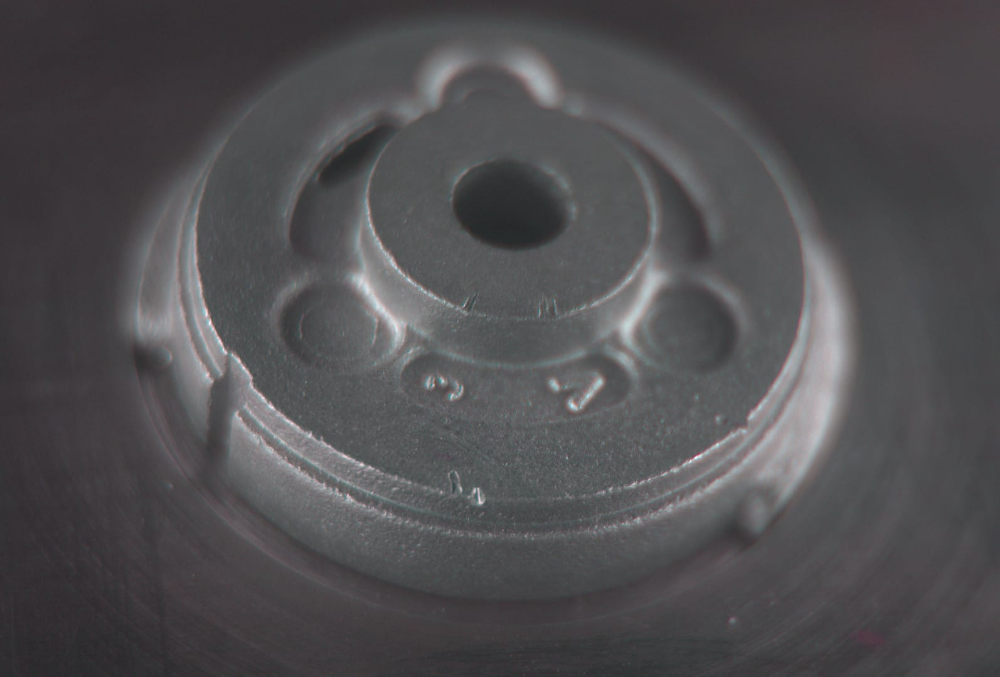
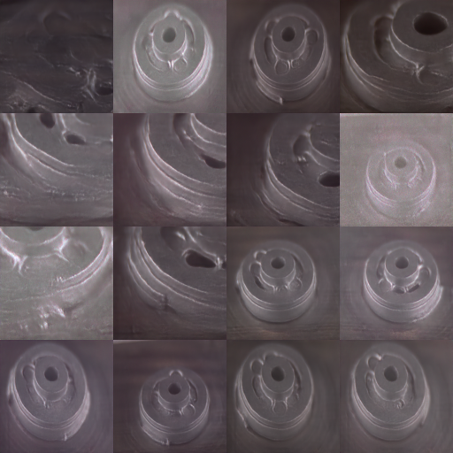
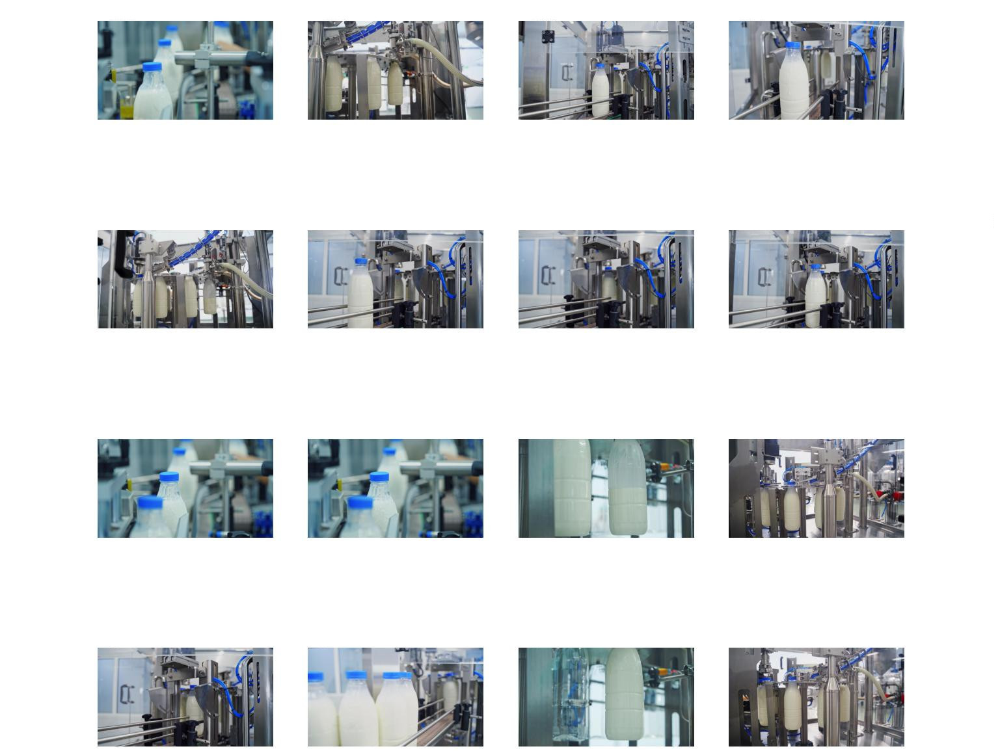
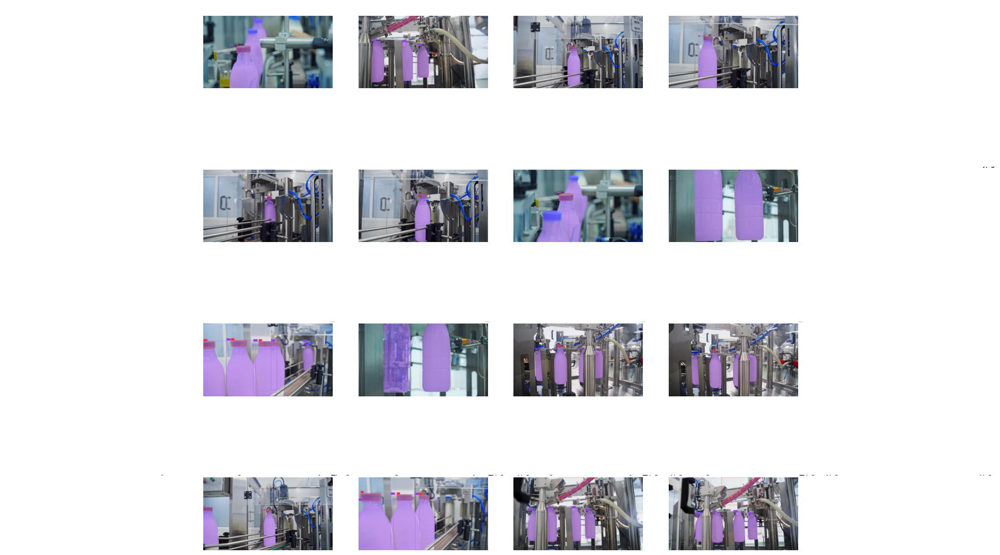

# Defected Industrial Parts Image Generation and Defect Detection

## Overview
This project focuses on generating images of industrial parts and detecting defects using various machine learning techniques. It includes the following main components:

1. Generating images of industrial parts using a diffusion model.
2. Using Autodistill to identify milk bottles and blue caps.
3. Inferencing an MM detection model on a generic image, then fine-tuning the model on COCO data, and finally fine-tuning it on an industrial dataset.
4. Fine-tuning a Grounding DINO model on a custom dataset.

## Table of Contents
- [Generating Images of Industrial Parts](#generating-images-of-industrial-parts)
- [Identifying Milk Bottles and Blue Caps with Autodistill](#identifying-milk-bottles-and-blue-caps-with-autodistill)
- [Inferencing and Fine-Tuning MM Detection Model](#inferencing-and-fine-tuning-mm-detection-model)
- [Fine-Tuning Grounding DINO on Custom Dataset](#fine-tuning-grounding-dino-on-custom-dataset)
- [License](#license)

## Generating Images of Industrial Part
This component utilizes a diffusion model to generate realistic images of industrial parts. The generated images can be used for various purposes such as training machine learning models, testing, and validation.

  
  &#8594;
  

### Steps:
1. **Setup and Install Dependencies**: Ensure all necessary libraries and dependencies for the diffusion model are installed.
2. **Model Training**: Train the diffusion model using a dataset of industrial parts.
3. **Image Generation**: Generate new images using the trained diffusion model.
#### Link to notebook [here](https://github.com/SahilCarterr/Defected-Industrial-Parts-Image-Generation-and-Defect-Detection/blob/889bd7f766978f560cfa6119af050ba3b3c0b70a/Defected%20Indestrial%20Parts%20Image%20Generation%20using%20Diffusion%20Model.ipynb)
## Identifying Milk Bottles and Blue Caps with Autodistill
Autodistill is employed to identify specific objects (milk bottles and blue caps) in images. This step involves training a detection model using Autodistill and performing object detection on new images.

  
  &#8594;
  

### Steps:
1. **Setup Autodistill**: Install and configure Autodistill for object detection tasks.
2. **Training**: Train the model to detect milk bottles and blue caps.
3. **Inference**: Run the trained model on new images to identify and localize milk bottles and blue caps.
#### Link to notebook [here](https://github.com/SahilCarterr/Defected-Industrial-Parts-Image-Generation-and-Defect-Detection/blob/889bd7f766978f560cfa6119af050ba3b3c0b70a/Autodistill%20Inference.ipynb)
## Inferencing and Fine-Tuning MM Detection Model
An MM detection model is first used on a generic image to perform object detection. The model is then fine-tuned using the COCO dataset and further fine-tuned on a specific industrial dataset for better performance in detecting defects.

**Figure 1:** Inference MMDetection
###

**Figure 2:** Finetuning on Ballon COCO dataset
###

**Figure 3:** Finetuning on Custom Industial dataset
### Steps:
1. **Initial Inference**: Use the MM detection model on a generic image to understand its performance.
2. **Fine-Tuning on COCO**: Fine-tune the MM detection model on the COCO dataset to detect ballon to understand its accuracy and generalization.
3. **Fine-Tuning on Industrial Dataset**: Further fine-tune the model on an industrial dataset to specialize it for defects detection in industrial parts.
#### Link to notebook [here](https://github.com/SahilCarterr/Defected-Industrial-Parts-Image-Generation-and-Defect-Detection/blob/889bd7f766978f560cfa6119af050ba3b3c0b70a/MMDetection%20Inference%20and%20Finetuning.ipynb)
## Fine-Tuning Grounding DINO on Custom Dataset
Grounding DINO is a state-of-the-art model for object detection. This section covers the fine-tuning of Grounding DINO on a custom dataset specific to industrial parts and defects using a prompt.

### Steps:
1. **Dataset Preparation**: Prepare a custom dataset with labeled images of industrial parts and defects.
2. **Model Configuration**: Configure the Grounding DINO model for fine-tuning.
3. **Fine-Tuning**: Train the Grounding DINO model on the custom dataset to improve its defect detection capabilities.

### Usage
To use this models and scripts,follow the instructions is given in the notebook here. Ensure all dependencies are installed and configured correctly.
#### Link to notebook [here](https://github.com/longzw1997/Open-GroundingDino/blob/main/examples/Training_Script_example.ipynb)
### License
[MIT]()
